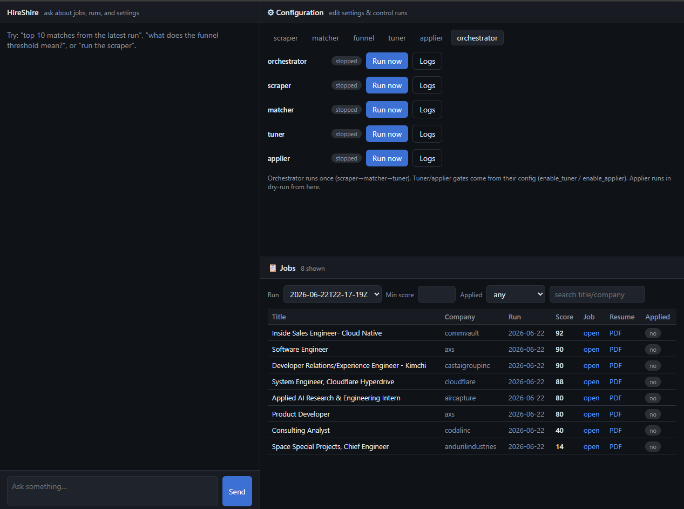
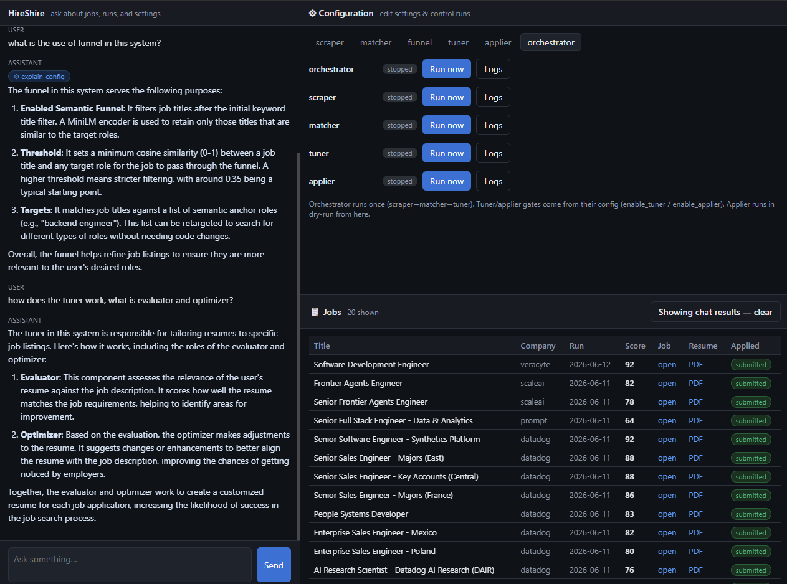
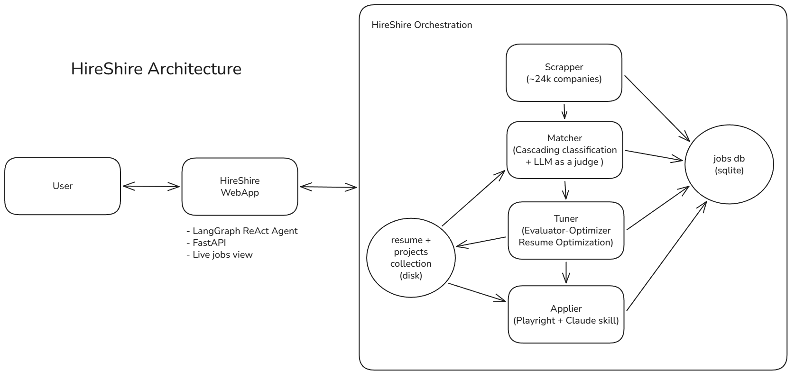

# HireShire

**An automated job search that runs itself.** HireShire watches **24,000+ live company job boards** across
five platforms, scores every open role against your resume with an LLM, rewrites your resume to fit the
jobs worth applying to, and fills out the applications — all driven from a local web dashboard you can
talk to.

Searching for a job at volume is the same four steps repeated hundreds of times: find the posting, work
out whether it's actually a fit, tailor your resume to it, and retype the same details into yet another
form. HireShire automates all four and keeps you in the loop at the points that matter.

<!--  -->



## What it does

| | | |
|---|---|---|
| **Discover** | Pulls open roles from **24,754 live company boards** across Greenhouse, Ashby, Lever, Workday, and BambooHR | Filters by location and posting age before anything else runs |
| **Score** | Ranks every job against your resume with an LLM (0–100) and shortlists the good ones | A keyword + semantic funnel drops obvious misses first, so you don't pay to score them |
| **Tailor** | Builds a resume per job — picks your most relevant projects, tunes the wording, compiles a one-page PDF | Bullets come from a corpus you wrote; the LLM selects, it doesn't invent |
| **Apply** | Fills and submits the application form, answering custom questions from your resume | `dry_run` fills without submitting until you're ready |
| **Dashboard** | Chat with your data, edit every setting, start/stop runs, and browse matches | The main way to use HireShire |

Runs are incremental — a job scored once is never scored again — so you can leave it on a schedule and
just check the dashboard.

## Scale

HireShire tracks **24,754 live company job boards** across five platforms — you're not curating a list of
twenty employers, you're sweeping most of the addressable market:

| Board | Companies |
|---|---:|
| BambooHR | 8,763 |
| Workday | 6,017 |
| Greenhouse | 5,432 |
| Ashby | 2,518 |
| Lever | 2,024 |
| **Total** | **24,754** |

The shipped slug lists are larger (40,065) but bulk-sourced, so many are dead. The scraper records each
genuine 404 in `config/bad_slugs.json` and skips it before any HTTP call, so those cost nothing and runs
get faster over time — the counts above are what a run actually touches. It self-heals both ways:
`python scripts/verify_bad_slugs.py --prune` restores any board that comes back online.

A single sweep at this scale is why the pipeline is built the way it is — async, per-board rate limits, a
cheap relevance funnel ahead of any paid LLM call, and one SQLite datastore instead of tens of thousands
of JSON files. Add a company by appending its slug to the matching `config/*_companies.json`.

## Architecture

<!-- Architecture diagram — replace docs/architecture.png with your exported diagram (PNG or SVG). -->


Each phase is independent — its own entrypoint, config, and module — and hands off to the next through a
shared `run_id`. All tabular data lives in one SQLite database (`data/hireshire.db`); only binaries
(tuned resume PDFs, application screenshots) sit on disk. The dashboard reads that database read-only,
so it never interferes with a running pipeline.

For the full breakdown — per-board API shapes, storage schema, every config key — see
[docs/design.md](docs/design.md).

## Requirements

| | |
|---|---|
| **Python 3.12** | the pipeline and API |
| **Node 22+** | builds the dashboard UI (once) |
| **`pdflatex`** | compiles tailored resumes (any TeX distribution: MiKTeX, TeX Live, MacTeX) |
| **An LLM API key** | one of Gemini, OpenAI, or Anthropic |

## Setup

**1. Install dependencies**

```bash
pip install -r requirements.txt
playwright install chromium        # for the applier
```

**2. Add your API key**

```bash
cp .env.example .env
```

Fill in the key for whichever provider you'll use, and set `LLM_PROVIDER` to match:

| Provider | Key | Get one at |
|---|---|---|
| Gemini | `GOOGLE_API_KEY` | [aistudio.google.com](https://aistudio.google.com) |
| OpenAI | `OPENAI_API_KEY` | [platform.openai.com](https://platform.openai.com) |
| Anthropic | `ANTHROPIC_API_KEY` | [console.anthropic.com](https://console.anthropic.com) |

Each phase can use a different provider — set `provider`/`model` in that phase's config to override.

**3. Add your resume**

Drop these under `data/resume_projects/` (gitignored — it's your personal data):

| File | Used by |
|---|---|
| `Your_Resume.pdf` | Matcher + Applier — the resume being scored and uploaded |
| `Your_Resume.tex` | Tuner — LaTeX source the evaluator critiques |
| `resume_template.tex` | Tuner — template with a `%{{EXPERIENCE_SECTIONS}}` placeholder |
| `projects_bullets.yaml` | Tuner — your pre-authored bullets, one set per project |

Using different filenames or locations is fine — point the matching `*_path` keys in
`config/matcher.yaml`, `config/tuner.yaml`, and `config/applier.yaml` at them.

**4. Build the dashboard**

```bash
cd frontend && npm install && npm run build && cd ..
```

## Using HireShire

### The dashboard

```bash
python run_web.py          # → http://127.0.0.1:8000
```

Three panels, one screen:

- **Chat with your data** — ask in plain English: *"top 10 matches from today"*, *"which jobs have a
  tuned resume but no application yet?"*, *"what does the funnel threshold actually mean?"* Answers come
  from your live database, and any jobs it surfaces drop straight into the job list. You can also ask it
  to start a run — it'll prepare the run and wait for you to confirm.
- **Settings** — every phase's configuration as a real form: location filters, score threshold, title
  keywords, which LLM scores jobs, your applicant details. Saving writes back to the YAML files
  (comments and all). Below it: run or stop any phase with live logs.
- **Jobs** — everything matched, filterable by run, score, and application status, with the tailored
  resume PDF one click away.

Set which LLM powers the chat in `config/frontend.yaml`.

### From the command line

The dashboard is a layer over ordinary scripts — every phase runs standalone:

```bash
python orchestrate.py --once         # run the whole pipeline once
python orchestrate.py --now          # run now, then every 4 hours
python orchestrate.py --interval 2   # every 2 hours instead
```

| Phase | Command | What it does |
|---|---|---|
| 1 · Scrape | `python scraper.py` | Fetch open roles from the configured boards |
| 2 · Match | `python matcher.py` | Score + shortlist against your resume |
| 3 · Tune | `python tuner.py` | Build a tailored resume PDF per shortlisted job |
| 4 · Apply | `/apply` *(or `python applier.py`)* | Fill and submit applications |

`python scripts/db_stats.py` shows what's in the database; `python scripts/prune_runs.py --keep 10`
reclaims space.

## Configuration

| File | Controls |
|---|---|
| `config/scraper.yaml` | Locations, posting age, concurrency and rate limits |
| `config/matcher.yaml` | Score threshold, scoring LLM, title keywords, the relevance funnel |
| `config/tuner.yaml` | Resume paths, evaluator/optimizer LLMs, `enable_tuner` |
| `config/applier.yaml` | `dry_run`, your applicant details, `enable_applier` |
| `config/frontend.yaml` | Dashboard host/port and the chat LLM |
| `config/*_companies.json` | The company lists per board — add a company by appending its slug |

The settings most worth changing are editable from the dashboard. Every key is documented in
[docs/design.md](docs/design.md).

## Safety

The applier submits **real applications**. Two independent gates:

- `enable_applier: false` in `config/applier.yaml` keeps the phase off entirely (the default).
- `dry_run: true` fills every form but never clicks submit.

Check both before a live run, and review the tailored resumes first.

## Documentation

| | |
|---|---|
| [docs/design.md](docs/design.md) | Technical reference — phase internals, API shapes, storage schema, every config key |
| [docs/design-decisions.md](docs/design-decisions.md) | Why the architecture is the way it is (ADR-style) |
| [CLAUDE.md](CLAUDE.md) | Orientation for Claude Code and contributors |
