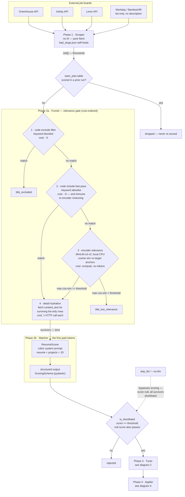
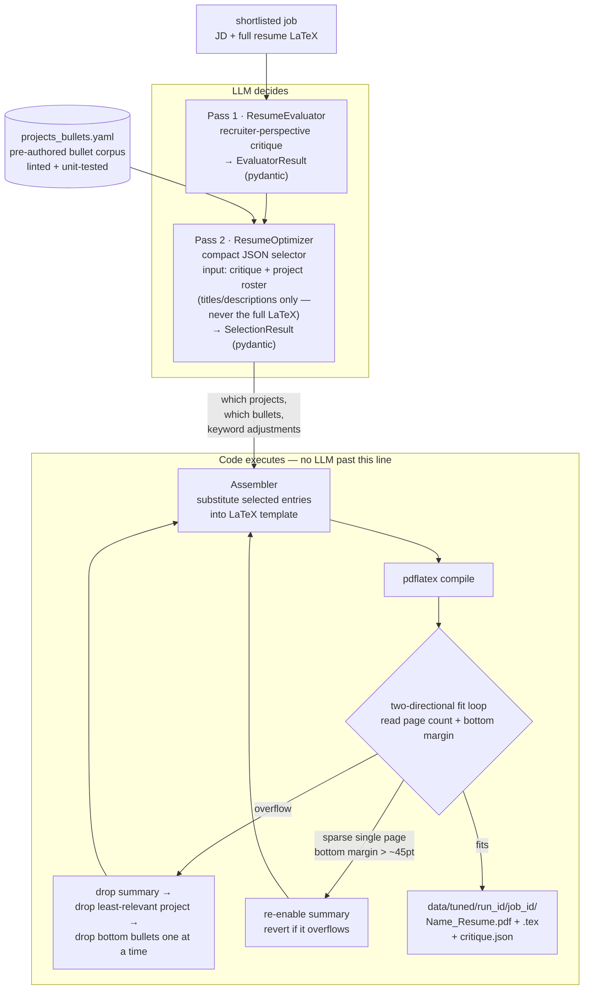
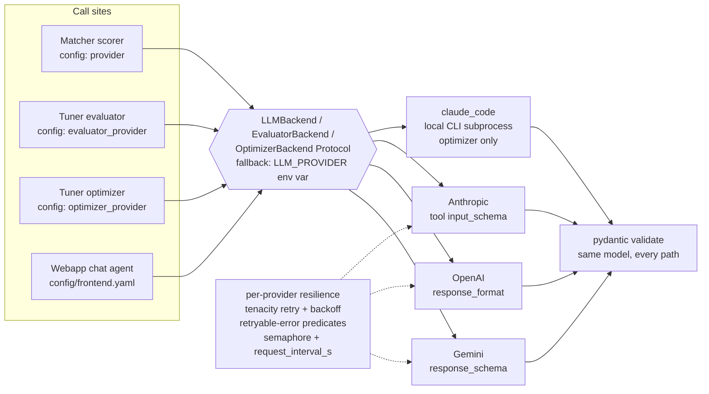
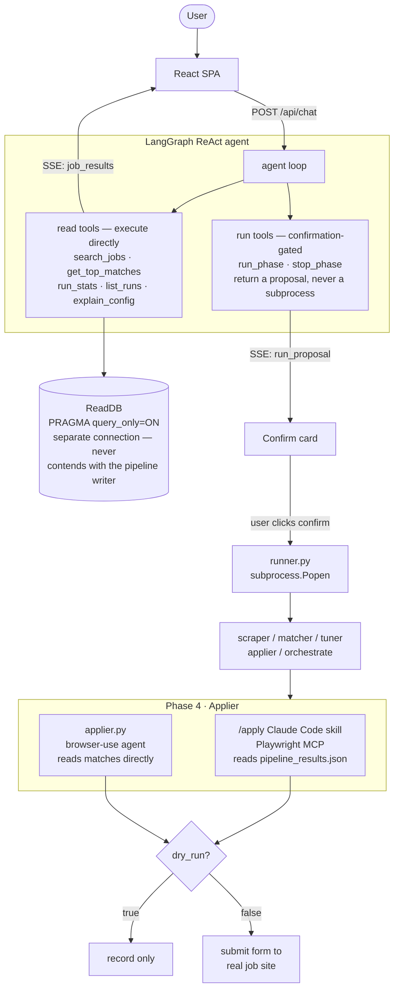

# HireShire — System Architecture (AI Engineering View)

Companion to `sys_arch.excalidraw`. These diagrams focus on the AI-engineering
surface: where tokens get spent, where structured output is enforced, where the
LLM decides vs. where code executes, and where a human stays in the loop.

---

## 1. The cost cascade — cheapest filter first, tokens last

The central design idea: a scrape yields thousands of jobs, but only tens are
worth an LLM call. Every stage below is ordered by cost per job, and each one
only sees what survived the stage above it.

**Why it's built this way:** stages 1 and 2 are string comparisons, stage 3 is a
local embedding model with no API cost, and stage 4 spends one HTTP call. Only
then does a job cost tokens. Retargeting the whole hunt to a different role is a
config edit — the `encoder.targets` anchor list — not a code change.

---

## 2. Tuner — the LLM/code boundary

Two LLM passes, then the LLM stops. Everything downstream of the selector is
deterministic code, so a hallucinated bullet can't reach the PDF: the model picks
from a pre-authored corpus, it doesn't write prose.

**Why it's built this way:** the expensive, unreliable step (judgement) is given
the smallest possible input and asked for the smallest possible output — a JSON
selection, not a document. Layout is a solved problem in code, so the fit loop
never burns a token.

---

## 3. Provider abstraction

Every LLM call site sits behind a Protocol, so a provider is a config key, not a
refactor. Structured output is enforced natively per provider, then re-validated
against the same pydantic model regardless of which path it came through.

---

## 4. Human in the loop — chat agent and applier

The two places the system can act on the world are both gated: the agent's run
tools return a *proposal*, and the applier honours a `dry_run` flag.

---

## Storage note

`data/hireshire.db` (SQLite, WAL) holds every tabular row, keyed by a shared
`run_id` — each phase writes under it, the next reads via `db.latest_run(phase)`.
Genuine artifacts (tuned PDFs/tex, applier screenshots) live on disk and are
referenced by path from the DB. Results are committed per row, so a mid-run crash
resumes without re-spending tokens on already-scored jobs.
